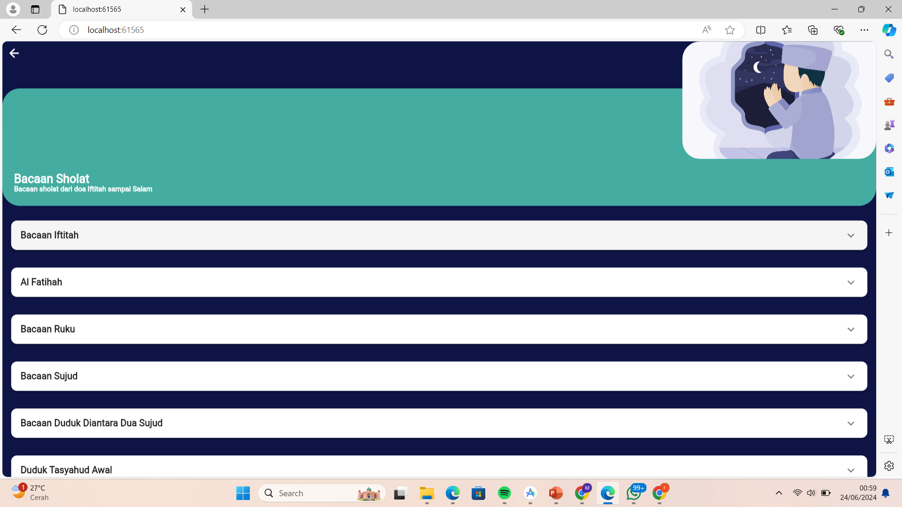

# Aplikasi Bacaaan Sholat
 

Sebagai seorang muslim sholat 5 waktu adalah wajib hukumnya. Shalat adalah tiang agama dan amal perbuatan seorang hamba yang pertama kali di hisap pada hari akhir nanti. Setiap umat muslim diwajibkan mengikuti tata cara shalat nabi Muhammad SAW, seperti yang telah beliau sabdakan kepada kita semua beliau bersabda “shalatlah kamu sekalian sebagaimana melihatku shalat”. oleh karena itu dibuatlah aplikasi bacaan sholat untuk mempermudah pengguna dalam belajar dan menghafalkan cara sholat sesuai dengan tuntunan yang di perintahkan.

## Nama Kelompok
<table border="1">
  <thead>
    <tr>
      <td>No</td>
      <td>NIM</td>
      <td>Nama Anggota</td>
    </tr>
  <thead>
  <tbody>
    <tr>
      <td>1</td>
      <td>19220077</td>
      <td>Muhammad Reza Fachrozi</td>
    </tr>
    <tr>
      <td>2</td>
      <td>19221563</td>
      <td>Gandring Eriansyah </td>
    </tr>
    <tr>
      <td>3</td>
      <td>19220952</td>
      <td>Galuh Akbar Adhiperdana </td>
    </tr>
    <tr>
      <td>4</td>
      <td>19220816</td>
      <td>Rangga Pratama Dewantoro </td>
    </tr>
    <tr>
      <td>4</td>
      <td>19221647</td>
      <td>Firman Adji Sanjaya</td>
    </tr>
    <tr>
      <td>4</td>
      <td>19220521</td>
      <td>Sabda Aji Utomo Putra </td>
    </tr>
  </tbody>
</table>

## 💻 Pengguna Sistem
Pengguna yang dapat memakai sistem ini adalah User.

## 👨‍💻 Skenario Kebutuhan Pengguna
### User
<ol>
  <li>Dapat melihat dan mendengarkan audio bacaan sholat</li>
  <li>agar dapat lebih mudah mempelajari dan menghafal bacaan sholat</li>
</ol>

## 🖼️ Screenshot Aplikasi
<table width="100%">
  <tbody>
    <tr>
      <td width="33%">
        <h5>Login Form</h5>
         
      </td>
      <td width="33%">
        <h5>Form Tambah Pegawai</h5>
        
      </td>
      <td width="33%">
        <h5>Form Detail Pegawai</h5>
        
      </td>
    </tr>
  </tbody>
</table>
<!-- Boleh tambahkan jumlah screenshot lebih dari 3 gambar agar lebih lengkap dalam pengenalan aplikasinya -->

## 📝 Prerequisite
Untuk menjalankan aplikasi ini disarankan untuk menyiapkan aplikasi berikut ini :
  - [x] Android Studio Giraffe <code>2022.03.1 Patch 1</code>
  - [x] Flutter <code>3.13.2</code>
  - [x] Dart <code>3.1.0</code>
  - [x] Java JDK <code>19.0.0</code>
  - [x] Git <code>2.35.1</code>

## Credit
Project ini mengacu pada modul praktik dari mata kuliah Mobile Programming Universitas Bina Sarana Informatika (UBSI) yang diampu oleh Bpk. <a href="https://github.com/yuris60">Yuris Alkhalifi, M.Kom., CPDSA</a> selaku Dosen.